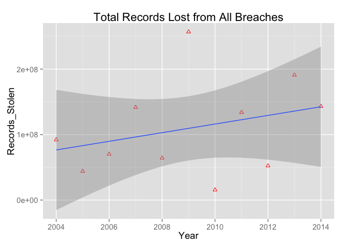
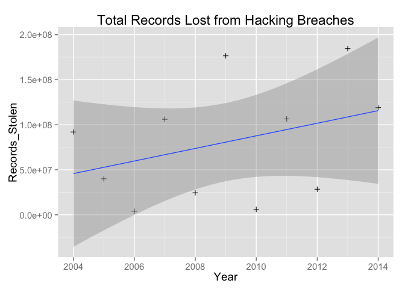
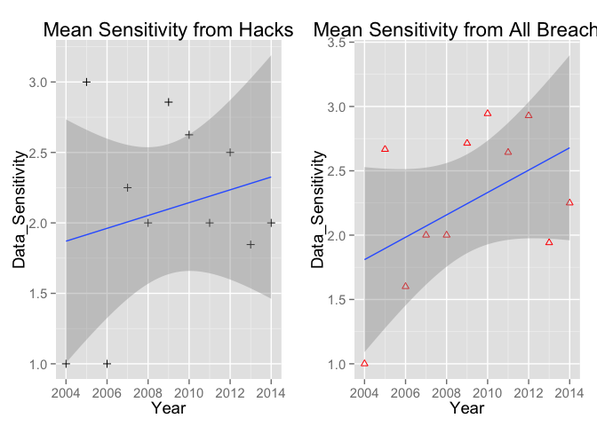

# Breaches Analysis


```
## Loading required package: ggplot2
## Loading required package: xtable
```

###Introduction

This is an analysis of information security breach data from the website [Information is Beautiful](http://www.informationisbeautiful.net/). They have made a really elegant bubble chart showing a very intuitive time evolution of data breaches which can be encoded for a number of factors. 

Thankfully they have also made their raw data compilation [available here](https://docs.google.com/spreadsheet/ccc?key=0AmenB57kGPGKdHh6eGpTR2lPQl9NZmo3RlVzQ1N2Ymc&single=true&gid=2&range=A1%3AW400#gid=2) so I've used it for this analysis to expand on some specific questions I wanted to address.  


The specific question I want to address here (quantitatively) is _"How much have the severity and number of hacking-induced data breaches changed over time and is it different than the general trend of breaches."_  

The conclusion is that while Hacks are increasing faster than the overall rate of breaches, the sensitivity of the data lost to hacks is not increasing as fast as that of breaches overall.

###Cleaned Data  

The data behind the Information is Beautiful chart are made available as a google doc. I've been unable (so far) to write a successful R program to download the data from the website directly, so in the interest of time I just downloaded their raw data as a .csv.  

I made the download copy of the data I use below available on the Github repository linked to this analysis. 


The data was generally in pretty good shape, but I did need to take some steps to clean it up for analysis in R.

Steps to clean the data include:
* Retaining only spreadsheet columns 1-10 to include only data I need.  
* Getting rid of a second descriptive row (which is not data).  
* converting column names to lower case and deleting spaces
* cleaning some formatting of numbers to remove commas etc.   
* Implementing some assumptions about the coding of severities. The legend runs between 1 (least severe) and 5 (most severe). Some of the data are outside this range (e.g. 20 and 50000). Based on my reading of details, I have assumed these are incorrect and have converted them to single digits.  
* Turned the year into actual numerical representation of a calendar year.  

You can see the details in the code.  


```
## Warning: NAs introduced by coercion
```

Here is a random subset of the cleaned data. 
You'll note that one row has blank data for number of records stolen. I'm not sure why that is. I plan to look into it later but don't have time right now. Judging from a back-of-the-envelope calculation I don't think it biases the conclusions of this analysis.  


<!-- html table generated in R 3.1.0 by xtable 1.7-3 package -->
<!-- Thu Sep 18 03:48:43 2014 -->
<TABLE border=1>
<TR> <TH>  </TH> <TH> entity </TH> <TH> year </TH> <TH> methodofleak </TH> <TH> noofrecordsstolen </TH> <TH> datasensitivity </TH>  </TR>
  <TR> <TD align="right"> 3 </TD> <TD> Adobe </TD> <TD align="right"> 2014 </TD> <TD> hacked </TD> <TD align="right"> 38000000 </TD> <TD align="right"> 5.00 </TD> </TR>
  <TR> <TD align="right"> 4 </TD> <TD> Advocate Medical Group </TD> <TD align="right"> 2014 </TD> <TD> lost / stolen media </TD> <TD align="right"> 4000000 </TD> <TD align="right"> 2.00 </TD> </TR>
  <TR> <TD align="right"> 13 </TD> <TD> AOL </TD> <TD align="right"> 2014 </TD> <TD> hacked </TD> <TD align="right">  </TD> <TD align="right"> 1.00 </TD> </TR>
  <TR> <TD align="right"> 28 </TD> <TD> UbiSoft </TD> <TD align="right"> 2013 </TD> <TD> hacked </TD> <TD align="right"> 58000000 </TD> <TD align="right"> 2.00 </TD> </TR>
  <TR> <TD align="right"> 52 </TD> <TD> Memorial Healthcare System </TD> <TD align="right"> 2011 </TD> <TD> lost / stolen media </TD> <TD align="right"> 102153 </TD> <TD align="right"> 2.00 </TD> </TR>
  <TR> <TD align="right"> 54 </TD> <TD> Nemours Foundation </TD> <TD align="right"> 2011 </TD> <TD> lost / stolen media  </TD> <TD align="right"> 1055489 </TD> <TD align="right"> 4.00 </TD> </TR>
  <TR> <TD align="right"> 56 </TD> <TD> Oregon Department of Motor Vehicles </TD> <TD align="right"> 2011 </TD> <TD> poor security </TD> <TD align="right"> 1000000 </TD> <TD align="right"> 2.00 </TD> </TR>
  <TR> <TD align="right"> 66 </TD> <TD> Stratfor </TD> <TD align="right"> 2011 </TD> <TD> accidentally published </TD> <TD align="right"> 935000 </TD> <TD align="right"> 3.00 </TD> </TR>
  <TR> <TD align="right"> 124 </TD> <TD> TD Ameritrade </TD> <TD align="right"> 2007 </TD> <TD> hacked </TD> <TD align="right"> 6300000 </TD> <TD align="right"> 1.00 </TD> </TR>
  <TR> <TD align="right"> 125 </TD> <TD> Texas Lottery </TD> <TD align="right"> 2007 </TD> <TD> inside job </TD> <TD align="right"> 89000 </TD> <TD align="right"> 2.00 </TD> </TR>
   </TABLE>

###Aggregate Records Lost  

The trend of total records lost from all data breaches shows a general upward trend. The plot below is a full aggregate of all the data. There is substantial year on year variation, dominantly from the fact that large data breaches are (thankfully) still rare from the standpoint that the 1/sqrt(N) is reasonably large. 

 


###Records Stolen by Hacking  

An interesting segmentation is to look at the records stolen by hacking (as opposed to, say, physical theft or an insider). Hacking is usually associated with malicious outside attack of a vulnerability. The industry is taking increased steps to close vulnerabilities, but the investment in hacks, especially by nation-states and organized crime, is also rising. 


 


As can be seen from the data, breaches from hacks vary significantly from year to year, but also have resulted in a generally upward trend of number of records being lost. The fitted trend line apparently rises faster than the trend line for the overall breaches. Indeed the rate of increase inrecords lost  6990 thousand/year is about 5.7 % higher than 6593 thousand/year records lost from all breaches.  

###Average severity of Records Stolen by Hacking versus the overall trend  


The record loss from hacks is increasing, as shown above, faster than the total of data breaches, but is the severity of the attacks also increasing?  

The data is categorized by severity on a scale of 1-5.   
1. Just email address/Online information   
2. SSN/Personal details   
3. Credit card information   
4. Email password/Health records   
5. Full bank account details  

The scale is of course arbitrary, but it is sensible and provides a systematic framework for measuring qualitative change. 

The analysis to compute the mean severity of attacks is straigtforward. The results, shown below, show that in fact while the severity of hacks are increasing, they are not increasing as fast as the severity of all attacks. 


```
## Loading required package: grid
```

 


So in response to the orginial question:  

_How much have the severity and number of hacking-induced data breaches changed over time and is it different than the general trend of breaches._ 

While number of hacking-induced data record losses has increased about 5.7 % per year faster than the number of records lost from breaches overall, we find the surprising result that the sensitivity of records lost from breaches overall is increasing 1.9 times faster than the sensitivity of Hacks. 

This means that while the number of hacked records is growing, the biggest problem from a data sensitivty standpoint is actually from other causes. 

The _number_ of records lost to hacks are increasing faster than the overall rate of record losses from data breaches, the _sensitivity_ of the data stolen by hackers is atually increasing more slowly than that from breaches overall.   

A couple of hypothesis:  
1. Hacking attacks, such as the large breach at Target or Home Depot, focused on stealing credit card numbers, presumably for financial gain. These activities, while getting larger, will be concentrated around sensitivity level 3. They are not after medical records in general.   
2. HIPAA now requires disclosure of breaches of medical records in some cases. Medical records on the scale used here, have higher sensitivity. So there may be a systematic bias in which data are reported that is affecting the overall trend.   

... which suggest questions for the next round a programming.
